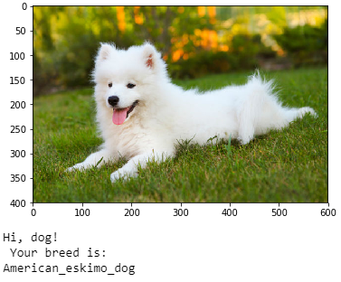

# Dog Breed Identification using Transfer Learning

Haoming Jin

## Project Overview

This project is a supplementary to my ["WeRateDogs Data Wrangling" project](https://github.com/carterjin/Twitter-WeRateDogs-Data-Wrangling), in which we used some results provided by Udacity which take dog pictures and predicts its dog breeds. Now I would like to implement this myself. I will build a pipeline that can be used within a web or mobile app for real-world images. Given an image, my algorithm will identify an estimation of the dog's breed. If given an image of a human, it will estimate the most resembling dog breed.

This Project also serves as my Capstone Project for Udacity Data Scientist Nanodegree. The training/validation/test data and bottleneck features data has already been given by Udacity, but I actually did it from scratch and want to show you how to do that. For example if you have only png files and labels, how would you do this.

The data is downloaded from [Dog Breed Identification Kaggle Competition](https://www.kaggle.com/c/dog-breed-identification/data). The original data is from [Stanford Dogs Dataset](http://vision.stanford.edu/aditya86/ImageNetDogs/). The data contains 10222 dog photos and labels indicating the breed, a total 120 different breeds.

Alternatively, in order to have this notebook run in Udacity, I am also including the data and methods I used for the Udacity Project: [dog dataset](https://s3-us-west-1.amazonaws.com/udacity-aind/dog-project/dogImages.zip), and differentiate which one to run by a variable: data_flag.

The data for human recognition is also provided by Udacity: [human dataset](https://s3-us-west-1.amazonaws.com/udacity-aind/dog-project/lfw.zip)

### Depedencies:

- keras 2.1.6
- tensorflow 1.14.0
- sklearn 0.19.1
- numpy
- pandas
- matplotlib
- openCV
- PIL

### [Notebook](https://github.com/carterjin/Dog-Breed-Identification-using-Transfer-Learning/blob/master/Dog_Breed_Prediction.ipynb)
This notebook provides the full analysis process and functional code for dog breed identification.

### [Python Module](https://github.com/carterjin/Dog-Breed-Identification-using-Transfer-Learning/blob/master/dog_breed_predict.py)
Using the model that I have trained you can import this python file see prediction results on your pictures.

__How to use__:
1. Download the model save files [1](https://github.com/carterjin/Dog-Breed-Identification-using-Transfer-Learning/blob/master/resnet50_dog_predict_model.part1.rar) [2](https://github.com/carterjin/Dog-Breed-Identification-using-Transfer-Learning/blob/master/resnet50_dog_predict_model.part2.rar) [3](https://github.com/carterjin/Dog-Breed-Identification-using-Transfer-Learning/blob/master/resnet50_dog_predict_model.part3.rar) [4](https://github.com/carterjin/Dog-Breed-Identification-using-Transfer-Learning/blob/master/resnet50_dog_predict_model.part4.rar) and extract them to the same directory as the python file.
2. Download the [Haars Cascade face detection pretrained weight](https://github.com/opencv/opencv/blob/master/data/haarcascades/haarcascade_frontalface_alt.xml) and put it in a folder ```haarcascades``` under the same directory as the python file.
3. Import and run as following:
```
from dog_breed_predict import DogBreedPredict

pred = DogBreedPredict()
pred.predict_breed('Your image file path')
```
You should be able to get a result like this:



### Webapp

The webapp implementation is here:

[https://github.com/carterjin/dog-breed-app](https://github.com/carterjin/dog-breed-app)

you can follow the installation instructions and try it out yourself!
